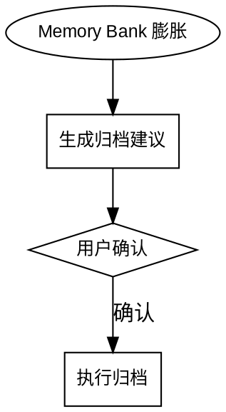

# Vibe Archive

## Overview

Memory Bank 归档技能。当 memory-bank 内容膨胀时，分析当前状态，安全地归档已完成的任务、功能和设计文档。

**核心原则：智能分析，建议优先，安全归档。**

---

## When to Use



**触发条件（任一即触发）：**
- `progress.md`: > 50 步
- `memory-bank/plans/feature-plan-*.md`: > 5 个已完成功能
- `memory-bank/plans/feature-design-*-g*-plan.md`: > 3 个已完成分组计划
- `memory-bank/designs/feature-design-*.md`: > 3 个已完成设计

**永不归档（始终保留）：**
- 架构文档（`memory-bank/architecture.md`）
- 技术栈文档（`memory-bank/tech-stack.md`）

**条件归档（确认时由用户选择）：**
- 已完成的设计文档（`memory-bank/designs/feature-design-*.md`）— 用户选择：全部归档或保留最新（推荐）

**不归档的内容：**
- 进行中的设计文档（未完成的 `memory-bank/designs/feature-design-*.md`）
- 进行中的功能文档（未完成的 `memory-bank/plans/feature-plan-*.md`）
- 进行中的分组计划文件（未完成的 `memory-bank/plans/feature-design-*-g*-plan.md`）

---

## 执行流程

### 第一步：分析 Memory Bank 状态

分析以下内容：
1. 统计 `progress.md` 行数和日期范围
2. 扫描 `memory-bank/plans/feature-plan-*.md` 文件，识别已完成和进行中的功能
3. 扫描 `memory-bank/plans/feature-design-*-g*-plan.md` 文件，识别已完成的分组计划
4. 扫描 `memory-bank/designs/feature-design-*.md` 文件，识别已完成和进行中的设计
5. 评估是否需要归档

### 第二步：生成归档建议

输出当前状态统计和归档建议。

- **达到阈值**：✅ 建议归档，列出具体收益
- **未达阈值**：⚠️ 警告"当前项目规模较小，归档可能导致上下文碎片化"，使用 AskUserQuestion 确认（选项：取消操作 / 强制归档）

### 第三步：确认归档计划

使用 AskUserQuestion 确认归档范围。

**设计文档归档模式**（存在已完成设计时）：
- **保留最新（推荐）**：归档所有已完成设计，仅保留修改时间最近的一个。保留的设计继续作为当前工作的活跃上下文。
- **全部归档**：将所有已完成设计移至归档。适用于进入全新阶段、不依赖先前设计的情况。

执行前将所选模式包含在确认摘要中。

### 第四步：执行归档

**归档目录结构：**

```
memory-bank/archive/
├── progress/
│   └── progress-archive-YYYY-MM-DD.md
├── features/
│   └── features-archive-YYYY-MM-DD.md
├── plans/
│   └── plans-archive-YYYY-MM-DD.md
├── designs/
│   └── designs-archive-YYYY-MM-DD.md
└── archived-items.md
```

**操作步骤：**
1. 创建归档目录
2. 移动已完成的文件到归档目录
3. 创建/更新 `memory-bank/archive/archived-items.md` 索引
4. 更新 `progress.md`（保留最近 50 步）

**索引模板：**

```markdown
# Memory Bank 归档索引

> 最后更新：YYYY-MM-DD

| 归档日期 | 归档文件 | 归档内容摘要 |
|----------|----------|--------------|
| YYYY-MM-DD | progress-archive-YYYY-MM-DD.md | progress.md [日期范围] 的已完成步骤 |
| YYYY-MM-DD | features-archive-YYYY-MM-DD.md | [功能名称列表] |
| YYYY-MM-DD | plans-archive-YYYY-MM-DD.md | 分组计划 [1-N] |
| YYYY-MM-DD | designs-archive-YYYY-MM-DD.md | [设计名称列表]（模式：保留最新 / 全部归档）|
```

### 第五步：验证

| 验证项 | 检查内容 |
|--------|----------|
| 归档完整性 | 归档文件正确创建 |
| 索引完整性 | archived-items.md 索引完整 |
| 进行中内容 | 进行中内容未受影响 |
| 基础文档 | architecture.md 和 tech-stack.md 未被移动 |
| 设计归档模式 | 若"保留最新"：designs/ 中恰好保留 1 个已完成设计 |
| 设计归档模式 | 若"全部归档"：designs/ 中无已完成设计 |

---

## 常见错误

| 错误 | 后果 | 正确做法 |
|------|------|----------|
| 归档 architecture.md 或 tech-stack.md | 丢失基础上下文 | 无论用户如何要求，这两个文件永不归档 |
| 归档未完成的设计或功能 | 活跃工作丢失 | 只归档已完成的内容 |
| 跳过用户确认 | 误删重要文件 | 必须等待用户确认 |
| 跳过设计归档模式选择 | designs/ 保留内容不明确 | 必须询问用户选择全部归档或保留最新 |

---

## 注意事项

- 归档文件存放在 `memory-bank/archive/`，迭代技能（vibe-iterate）不读取归档记录
- 归档是单向操作，执行前确认范围
