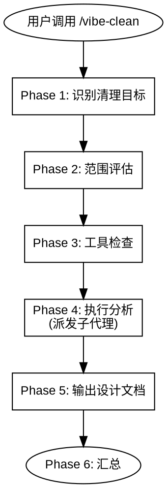

# Vibe Clean

## 概述

分析代码的清理机会，输出设计文档。不直接修改代码——分析结果生成 `feature-design-clean-*.md`，交由 `/vibe-plan` → `/vibe-iterate` 执行。

核心原则：
- 子代理只读分析——发现问题，不修改代码
- 输出遵循 vibe-design 文档格式，确保流水线兼容
- 不自动执行——用户控制所有后续步骤

硬规则：
- **分析前必须确认检测工具已安装。** 工具缺失时停止分析，提示用户安装。不静默降级到 grep。
- **子代理只读。** 只报告发现，不编辑代码。
- **输出为设计文档。** 实际清理通过 vibe-plan → vibe-iterate 完成。



---

## 使用场景

**适用于：**
- 项目积累了废代码、未使用的依赖或重复逻辑
- 大型重构或功能移除后
- 发布前减少包体积和技术债务
- 定期代码库健康检查

**不适用于：**
- 调试问题（使用 /vibe-hunt）
- 设计新功能（使用 /vibe-design）
- 审查代码质量（使用 /vibe-review）
- 性能优化

---

## 参考文件

| 参考文件 | 用途 |
|----------|------|
| `references/cleanup-catalog.md` | 子代理激活条件（按深度分级） |
| `agents/simplification-analyzer.md` | 代码简化分析 agent |
| `agents/dead-code-analyzer.md` | 废代码检测 agent |
| `agents/duplicate-analyzer.md` | 重复代码检测 agent |

---

## Phase 1: 识别清理目标

自动检测或询问用户：

| 目标 | 检测方式 | 范围 |
|------|----------|------|
| 变更文件 | 当前分支与 base 分支的 diff | 仅分支差异 |
| 指定路径 | 用户提供目录或文件 glob | 用户指定范围 |
| 全项目 | 用户明确要求 | 整个代码库（谨慎使用） |

默认：当前分支变更文件。不确定时用 AskUserQuestion 确认。

---

## Phase 2: 范围评估

衡量目标规模并分级：

| 深度 | 标准 | 激活的 Agent |
|------|------|-------------|
| **Surface** | < 50 行，1-5 文件 | 仅 `simplification-analyzer` |
| **Standard** | 50-200 行，或 6-15 文件 | + `dead-code-analyzer` |
| **Deep** | 200+ 行，15+ 文件，或用户要求全面清理 | + `duplicate-analyzer` |

声明深度后再继续。

---

## Phase 3: 工具检查

根据项目类型检查检测工具：

| 工具 | 语言 | 检查命令 | 安装命令 |
|------|------|----------|----------|
| knip | JS/TS | `npx knip --version` | `npm install -D knip` |
| depcheck | JS/TS | `npx depcheck --version` | `npm install -D depcheck` |
| ts-prune | TypeScript | `npx ts-prune --version` | `npm install -D ts-prune` |
| vulture | Python | `vulture --version` | `pip install vulture` |
| deadcode | Go | `deadcode -h` | `go install golang.org/x/tools/cmd/deadcode@latest` |
| cargo-udeps | Rust | `cargo udeps --version` | （cargo nightly 内置） |

**工具未安装时：**
1. 停止分析
2. 告知用户缺少哪个工具及安装命令
3. 询问：(a) 安装后继续 (b) 跳过此工具 (c) 终止

不静默降级到 grep 检测。

---

## Phase 4: 执行分析

### 子代理派发

加载 `references/cleanup-catalog.md` 确认激活条件。**并行**派发已激活的 agent，传递：
- 目标范围（文件列表或 diff）
- 项目类型和语言
- 已获取的工具输出

### 发现分类

每个 agent 按以下标准分类：

| 分类 | 定义 | 示例 |
|------|------|------|
| SAFE | 未使用、无引用、无动态消费者 | 未使用的私有函数、遗留 helper、未使用的依赖 |
| CAUTION | 可能有动态或间接消费者 | 路由配置中的组件、数组中的中间件 |
| DANGER | 公共 API、配置、入口点 | 导出的工具函数、barrel 导出、配置常量 |

### 合并规则

- 同一位置被多个 agent 标记：合并，保留最高严重度
- 不同位置：保留各自的发现
- 跨 agent 去重（不同工具报告同一发现）

---

## Phase 5: 输出设计文档

将所有发现汇总为 `memory-bank/designs/feature-design-clean-[name].md`。

遵循 feature-design 模板格式：

- **架构概览**：引用现有 architecture.md，描述清理范围
- **阶段划分**：每个清理类别为一个阶段（仅包含有发现的阶段）
  - Phase 0: 表面清理（未使用的 imports、console.log、注释掉的代码）
  - Phase 1: 废代码移除（未使用的 exports、函数、依赖）
  - Phase 2: 代码简化（条件逻辑、命名、结构）
  - Phase 3: 重复代码合并（近似重复函数、冗余类型）
- **阶段详情**：具体文件和发现，按安全等级（SAFE/CAUTION/DANGER）分类
- **计划分组**：按目录或模块耦合度分组
- **验收标准**：测试通过、构建成功、包体积减少（如适用）

每个阶段的验证：运行项目测试套件 → 全部通过。

---

## Phase 6: 汇总

```
## 清理分析

目标：           [清理目标描述]
范围：           N 文件，N 行分析
深度：           surface / standard / deep
使用的 Agent：   [simplification, dead-code, duplicate]

### 发现摘要

| 分类 | SAFE | CAUTION | DANGER | 合计 |
|------|------|---------|--------|------|
| 废代码 | N | N | N | N |
| 简化机会 | N | - | - | N |
| 重复代码 | N | N | - | N |

### 输出

设计文档：memory-bank/designs/feature-design-clean-[name].md
```

**停。** 等用户审查设计文档后决定下一步。

---

## 常见错误

| 错误 | 后果 | 正确做法 |
|------|------|----------|
| 跳过工具检查 | 工具不全导致分析不完整 | 必须检查并提示安装 |
| 子代理修改代码 | 代码库出现未验证的变更 | 子代理为只读分析器 |
| 输出非标准格式 | vibe-plan 无法解析 | 遵循 feature-design 模板 |
| 默认分析全仓库 | 结果缓慢且庞大 | 默认分析分支 diff，全扫描需用户明确要求 |
| 静默降级到 grep | 遗漏动态导入导致误报 | 工具缺失时提示用户 |

---

## 下一步

设计文档生成后，使用 AskUserQuestion 建议：

| 技能 | 目的 |
|------|------|
| /vibe-plan | 从清理设计创建实施计划 |
| /vibe-design | 调整或扩展清理设计 |
