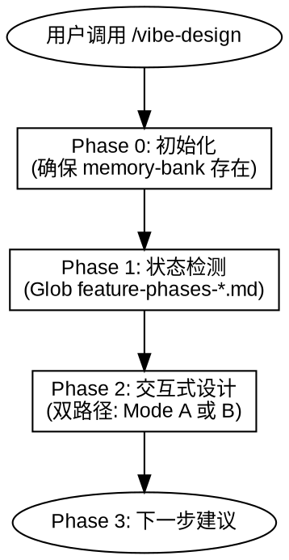
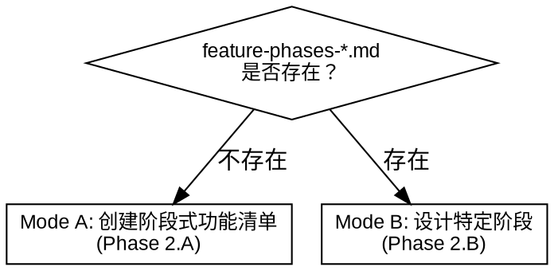

# Vibe Design

## Overview

**Vibe Design** 通过交互式问答（逐个提问）将用户想法变为阶段式功能清单和逐阶段设计文档。仅做设计，不修复问题，设计完成不自动执行。

核心原则：
- 通过 AskUserQuestion 逐个提问，分节探索用户需求
- 每个问题等待用户确认后再继续
- 设计完成后等待用户指令或用户调用 /vibe-plan

硬规则：
- **初始化必须在任何代码编写之前。** 无论项目紧急程度、规模大小、partner 意见。没有 memory-bank 结构，后续所有 vibe 技能都会失效。
- **发现缺少 memory-bank 时立即暂停编码。** 已写代码不会丢失，但必须纳入 memory-bank 管理结构后才能继续。

智能检测：
- 无 `feature-phases-*.md` → 创建阶段式功能清单（Mode A）
- 已有 `feature-phases-*.md` → 设计特定阶段（Mode B）



---

## When to Use

**使用场景：**
- 创建阶段式功能清单（项目或功能集）
- 对功能清单中的各阶段进行详细设计
- 参考外部文档（迁移指南、技术方案）构建分阶段设计

**不适用场景：**
- 修复 bug 或调试问题
- 需要自动执行后续步骤

---

## References

| 参考文件 | 用途 |
|----------|------|
| `references/interaction-principles.md` | 核心问答与设计呈现原则 |
| `references/feature-phases-template.md` | 阶段式功能清单文档模板 |
| `references/feature-design-template.md` | 逐阶段设计文档模板 |
| `references/architecture-template.md` | 架构文档模板 |
| `references/tech-stack-template.md` | 技术栈文档模板 |

---

## Phase 0: 初始化

检查项目根目录下是否存在 `memory-bank` 文件夹。如不存在则创建。

---

## Phase 1: 状态检测

```bash
# 使用 Glob 检查是否存在阶段式功能清单
Glob pattern: "memory-bank/feature-phases-*.md"
```



---

## Phase 2: 交互式设计

所有问答遵循 `references/interaction-principles.md`。关键规则：

- 通过 AskUserQuestion 每次只问一个问题。优先使用结构化选项，而非开放式提问。
- 以小段落（200-300 字）逐步呈现设计，每段后确认方向。
- 每个决策提供 2-3 个备选方案及权衡，明确推荐项。
- 严格 YAGNI：砍掉没人要求的功能。
- 输出文档中无占位符（TBD/TODO/"待定"）。
- 每个维度确认后再继续。用户反馈变化时可自由回溯。

### Mode A: 创建阶段式功能清单

始终生成 `feature-phases-[name].md`。这是所有新设计工作的入口。

**Step 1: 理解需求**

分析用户输入，理解构建目标：
- 检查参考文档（文件路径、`refs/` 目录）
- 读取参考文档，提取关键信息：总体目标、技术栈、已有阶段划分、依赖关系
- 向用户确认理解是否正确

如无参考文档：
- 通过 Q&A 探索：目标是什么、已有什么、技术上下文是什么
- 以 200-300 字的摘要呈现理解，请用户确认

**Step 2: 架构与技术栈**

在创建阶段式功能清单之前，先建立项目架构和技术栈的独立文档。

**2a. 检查已有文档**

```bash
# 检查 architecture.md 和 tech-stack.md 是否已存在
Glob pattern: "memory-bank/architecture.md"
Glob pattern: "memory-bank/tech-stack.md"
```

如两者都已存在，向用户确认是否仍反映当前状态。如是，跳至 Step 3。如否，通过 Q&A 更新。

**2b. 交互式 Q&A**

逐个探索架构维度（仅针对缺失或过时的文档）：
1. **目的和范围** — 一句话项目目的，包含/不包含什么
2. **架构图** — ASCII 图或组件关系描述，组件职责
3. **目录结构** — 规划的文件布局
4. **技术栈** — 语言、框架、工具、版本、选型理由
5. **外部服务** — 第三方 API、SDK、约束

每个维度确认后再继续。

**2c. 生成文档**

创建或更新：
- `memory-bank/architecture.md`（模板：`references/architecture-template.md`）
- `memory-bank/tech-stack.md`（模板：`references/tech-stack-template.md`）

这两个文档是项目架构和技术选型的单一事实来源。所有 feature-phases 和 feature-design 文档引用它们。

**Step 3: 阶段划分**

呈现阶段划分。每个阶段必须可独立编译和验证：
1. 展示阶段列表：名称、目标、依赖关系、验证策略
2. 逐阶段与用户确认
3. 允许调整：合并、拆分、重新排序
4. 所有阶段初始状态为 `pending`

**Step 4: 文档生成**

生成 `memory-bank/feature-phases-[name].md`（模板见 `references/feature-phases-template.md`）。架构概览部分引用 `architecture.md` 和 `tech-stack.md`，不重复其内容。

### Mode B: 设计特定阶段

适用于：`feature-phases-*.md` 已存在，用户想逐个设计各阶段。

**Step 1: 阶段状态展示**

检查 `memory-bank/architecture.md` 和 `memory-bank/tech-stack.md` 是否存在。如任一缺失，提醒用户并建议先通过 Mode A Step 2 建立项目基础文档。

读取 `feature-phases-*.md` 中的阶段列表，检查 `memory-bank/` 中已有的 feature-design 文件，展示阶段状态：

```
| Phase | 名称 | 状态 |
|-------|------|------|
| Phase 0 | NPY 读取 | done |
| Phase 1 | EmbeddingStore | designing |
| Phase 2 | Prefill 构建 | pending |
| ... | ... | ... |
```

**Step 2: 阶段选择**

询问用户要设计哪个阶段。默认推荐：按顺序下一个 pending 阶段。用户也可以指定任意阶段。

**Step 3: 功能设计 Q&A**

逐个探索选定阶段的需求：
1. **功能名称和目标** — 这个阶段要达成什么（可从阶段描述自动填充）
2. **实现方案和权衡** — 2-3 个备选方案、优缺点对比
3. **需要创建/修改的文件** — 影响范围
4. **关键技术细节** — 接口、数据结构、算法（仅在相关时）
5. **验证策略** — 如何独立测试该阶段

**Step 4: 文档生成**

创建 `memory-bank/feature-design-[name].md`，头部标注所属阶段和状态：

```markdown
> Phase: Phase N - [阶段名称]
> Project: feature-phases-[name].md
> Status: pending
```

然后将 `feature-phases-*.md` 中对应阶段的状态从 `pending` 更新为 `designing`。

**Step 5: 继续下一阶段**

完成后询问用户是否继续设计下一阶段。如继续，回到 Step 2。如停止，进入 Phase 3。

---

## Phase 3: 下一步

使用 AskUserQuestion 建议用户下一步操作：

| 技能 | 目的 |
|------|------|
| /vibe-plan | 为已设计的阶段创建实施计划 |
| /vibe-design | 继续设计下一阶段 |

设计完成后**不自动执行任何操作**，等待用户指令。

---

## 状态生命周期

文档通过状态值追踪实施进度：

| 文档 | 状态字段 | 取值 |
|------|---------|------|
| `feature-phases-*.md` | 每阶段状态列 | `pending` → `designing` → `done` |
| `feature-design-*.md` | 头部 `Status:` | `pending` → `done` |

**谁更新状态：**
- `pending` → `designing`：vibe-design（Mode B Step 4，创建 feature-design 时）
- `designing` → `done`：vibe-iterate（完成该阶段所有步骤后）
- feature-design 中 `pending` → `done`：vibe-iterate（完成该阶段所有步骤后）

---

## 常见错误

| 错误 | 后果 | 正确做法 |
|------|------|----------|
| 跳过交互直接输出 | 设计质量低下 | 必须逐个问题探索后再输出文档 |
| 设计完自动执行 | 用户失去控制 | 设计完成即停止，等待指令 |
| 文件命名不规范 | 后续技能找不到文档 | 严格使用 feature-phases- / feature-design- 前缀 |
| 参考文档内容直接复制 | 缺少用户意图确认 | 参考文档仅作输入，必须经 Q&A 确认 |
| 一次设计所有阶段 | 用户 overwhelmed | 分阶段逐个设计，每阶段确认后再继续 |
| 创建 feature-design 后忘记更新 feature-phases 状态 | 状态表过时 | 创建 feature-design 时必须同步更新 feature-phases 状态 |
