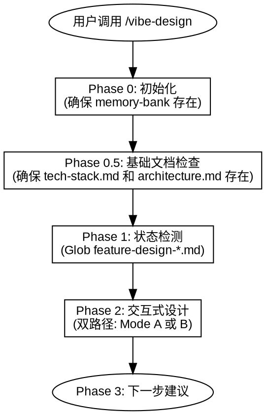
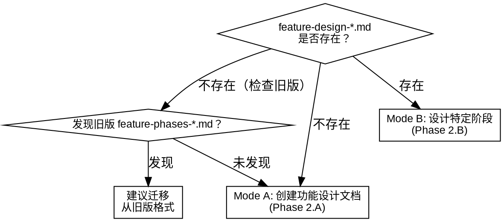

# Vibe Design

## 概述

**Vibe Design** 通过交互式问答（逐个提问）将用户想法变为功能设计文档。单一 `feature-design-*.md` 文档同时包含阶段式功能清单和逐阶段设计详情。仅做设计，不修复问题，设计完成不自动执行。

核心原则：
- 通过 AskUserQuestion 逐个提问，分节探索用户需求
- 每个问题等待用户确认后再继续
- 设计完成后等待用户指令或用户调用 /vibe-plan

硬规则：
- **tech-stack.md 和 architecture.md 必须在设计工作开始前存在。** 如任一缺失，必须先创建或补充。这是阻塞性检查——没有这两个文件不能进行任何设计工作。
- **初始化必须在任何代码编写之前。** 无论项目紧急程度、规模大小、partner 意见。没有 memory-bank 结构，后续所有 vibe 技能都会失效。
- **发现缺少 memory-bank 时立即暂停编码。** 已写代码不会丢失，但必须纳入 memory-bank 管理结构后才能继续。
- **所有文档内容必须注明参考出处。** 每个声明、决策或技术细节如引用外部资料，必须标注来源（URL、`refs/` 文件）。文档末尾附参考列表。遵循原则：先探索收集资料 → 编写文档 → 后验证。

智能检测：
- 无 `feature-design-*.md` → 创建新功能设计文档（Mode A）
- 已有 `feature-design-*.md` → 设计特定阶段（Mode B）
- 发现旧版 `feature-phases-*.md` 但无对应 `feature-design-*.md` → 建议迁移



---

## 使用场景

**适用于：**
- 创建包含阶段划分的功能设计文档
- 对已有设计文档中的各阶段进行详细设计
- 参考外部文档（迁移指南、技术方案）构建设计

**不适用于：**
- 修复 bug 或调试问题
- 需要自动执行后续步骤

---

## 参考文件

| 参考文件 | 用途 |
|----------|------|
| `references/interaction-principles.md` | 核心问答与设计呈现原则 |
| `references/feature-design-template.md` | 功能设计文档模板（含阶段划分） |
| `references/architecture-template.md` | 架构文档模板 |
| `references/tech-stack-template.md` | 技术栈文档模板 |

---

## Phase 0: 初始化

检查项目根目录下是否存在 `memory-bank` 文件夹。如不存在则创建。

---

## Phase 0.5: 基础文档检查

读取 `memory-bank/architecture.md` 和 `memory-bank/tech-stack.md`。两者必须存在才能继续。

```bash
Glob pattern: "memory-bank/architecture.md"
Glob pattern: "memory-bank/tech-stack.md"
```

| 检测结果 | 动作 |
|----------|------|
| 两者都存在 | 向用户确认是否仍反映当前状态。如是，继续到 Phase 1 |
| 任一缺失 | 进入基础文档创建流程 |

**基础文档创建流程：**

逐个探索架构维度（仅针对缺失或过时的文档）：
1. **目的和范围** — 一句话项目目的，包含/不包含什么
2. **架构图** — ASCII 图或组件关系描述，组件职责
3. **目录结构** — 规划的文件布局
4. **技术栈** — 语言、框架、工具、版本、选型理由
5. **外部服务** — 第三方 API、SDK、约束

每个维度确认后再继续。

生成文档：
- `memory-bank/architecture.md`（模板：`references/architecture-template.md`）
- `memory-bank/tech-stack.md`（模板：`references/tech-stack-template.md`）

这两个文档是项目架构和技术选型的单一事实来源。所有 feature-design 文档引用它们。

---

## Phase 1: 状态检测

```bash
Glob pattern: "memory-bank/designs/feature-design-*.md"
Glob pattern: "memory-bank/designs/feature-phases-*.md"
```



**旧版迁移：** 如发现 `feature-phases-*.md` 但没有对应的 `feature-design-*.md`，建议用户将旧版文档合并为新版 `feature-design-*.md` 格式。提供迁移指导：复制阶段表、阶段详情和计划分组，然后添加 Phase Designs 部分。

---

## Phase 2: 交互式设计

所有问答遵循 `references/interaction-principles.md`。关键规则：

- 通过 AskUserQuestion 每次只问一个问题。优先使用结构化选项，而非开放式提问。
- 以小段落（200-300 字）逐步呈现设计，每段后确认方向。
- 每个决策提供 2-3 个备选方案及权衡，明确推荐项。
- 严格 YAGNI：砍掉没人要求的功能。
- 输出文档中无占位符（TBD/TODO/"待定"）。
- 每个维度确认后再继续。用户反馈变化时可自由回溯。

### Mode A: 创建功能设计文档

始终生成 `feature-design-[name].md`。这是所有新设计工作的入口。文档同时包含阶段概览和逐阶段设计部分。

**Step 1: 理解需求**

分析用户输入，理解构建目标：
- 检查参考文档（文件路径、`refs/` 目录）
- 读取参考文档，提取关键信息：总体目标、技术栈、已有阶段划分、依赖关系
- 向用户确认理解是否正确

如无参考文档：
- 通过 Q&A 探索：目标是什么、已有什么、技术上下文是什么
- 以 200-300 字的摘要呈现理解，请用户确认

**Step 2: 阶段划分**

呈现阶段划分。每个阶段必须可独立编译和验证：
1. 展示阶段列表：名称、目标、依赖关系、验证策略
2. 逐阶段与用户确认
3. 允许调整：合并、拆分、重新排序
4. 所有阶段初始状态为 `pending`

**Step 2.5: 计划分组**

阶段划分确认后，评估如何将阶段分组为实施计划。复杂项目生成多个计划文件；简单项目可能只需一个计划。

**分析信号：**
1. 相邻阶段共享 >2 个文件 → 合并
2. 阶段 B 完全依赖阶段 A 的产出 → 合并
3. 单阶段步骤 <3 且无独立验证价值 → 与相邻阶段合并
4. 阶段间可独立编译和验证 → 保持独立

**流程：**
1. 分析阶段依赖、共享文件和复杂度
2. 建议分组：`| 分组 | 阶段 | 理由 |`
3. 交互式确认：用户接受、调整或覆盖
4. 将分组信息存入 Plan Groups 部分

**示例输出：**
```
| 分组 | 阶段 | 理由 |
|------|------|------|
| G1 | Phase 0, Phase 1 | 基础搭建，共享配置 |
| G2 | Phase 2, Phase 3 | 核心功能，共享数据模型 |
| G3 | Phase 4 | 独立增强 |
```

**Step 3: 文档生成**

生成 `memory-bank/designs/feature-design-[name].md`（模板：`references/feature-design-template.md`）。文档包含：
- 架构概览（引用 architecture.md 和 tech-stack.md）
- 阶段表 + 阶段详情
- 计划分组
- 阶段设计部分（Mode B 填充的空占位）

**Step 3.5: 预填充已知设计**

如果某些阶段设计显而易见（如简单工具、样板配置），询问用户是否想在 Mode A 阶段预填充该 Phase Design 部分。默认留空由 Mode B 填充。

### Mode B: 设计特定阶段

适用于：`feature-design-*.md` 已存在，用户想逐个设计各阶段。

**Step 1: 阶段状态展示**

读取 `feature-design-*.md` 中的阶段列表，检查哪些 Phase Designs 部分已有内容，展示阶段状态：

```
| Phase | 名称 | 状态 |
|-------|------|------|
| Phase 0 | NPY 读取 | done |
| Phase 1 | EmbeddingStore | designing |
| Phase 2 | Prefill 构建 | pending |
| ... | ... | ... |
```

**Step 2: 阶段选择**

询问用户要设计哪个阶段。默认推荐：按顺序下一个 pending 阶段。用户也可以指定任意阶段。

**Step 3: 功能设计 Q&A**

逐个探索选定阶段的需求：
1. **功能名称和目标** — 这个阶段要达成什么（可从阶段描述自动填充）
2. **实现方案和权衡** — 2-3 个备选方案、优缺点对比
3. **需要创建/修改的文件** — 影响范围
4. **关键技术细节** — 接口、数据结构、算法（仅在相关时）
5. **验证策略** — 如何独立测试该阶段

**Step 4: 文档更新**

在 `feature-design-*.md` 中填充对应的 Phase Design 部分：
- 设计方案（概述、对比、技术考虑）
- 用户交互（故事、流程）
- 验收标准（可测试的）

然后将 Phases 表中对应阶段的状态从 `pending` 更新为 `designing`。

**Step 5: 继续下一阶段**

完成后询问用户是否继续设计下一阶段。如继续，回到 Step 2。如停止，进入 Phase 3。

---

## Phase 3: 下一步

使用 AskUserQuestion 建议用户下一步操作：

| 技能 | 目的 |
|------|------|
| /vibe-plan | 为已设计的阶段创建实施计划 |
| /vibe-design | 继续设计下一阶段 |

设计完成后**不自动执行任何操作**，等待用户指令。

---

## 状态生命周期

文档通过状态值追踪实施进度：

| 文档 | 状态字段 | 取值 |
|------|---------|------|
| `feature-design-*.md` 阶段表 | 每阶段状态列 | `pending` → `designing` → `done` |
| `feature-design-*.md` 阶段设计 | 部分内容 | 空 → 已填充 |

**谁更新状态：**
- `pending` → `designing`：vibe-design（Mode B Step 4，填充 Phase Design 部分时）
- `designing` → `done`：vibe-iterate（完成该阶段所属 group 的所有步骤后）
- Phase Design 内容：vibe-design 填充，vibe-iterate 标记完成

---

## 常见错误

| 错误 | 后果 | 正确做法 |
|------|------|----------|
| 跳过 tech-stack/architecture 检查 | 缺少技术上下文做设计 | 必须在设计工作前验证两个文件存在 |
| 跳过交互直接输出 | 设计质量低下 | 必须逐个问题探索后再输出文档 |
| 设计完自动执行 | 用户失去控制 | 设计完成即停止，等待指令 |
| 文件命名不规范 | 后续技能找不到文档 | 严格使用 feature-design- 前缀 |
| 参考文档内容直接复制 | 缺少用户意图确认 | 参考文档仅作输入，必须经 Q&A 确认 |
| 一次设计所有阶段 | 用户 overwhelmed | 分阶段逐个设计，每阶段确认后再继续 |
| 填充 Phase Design 后忘记更新 Phases 表状态 | 状态表过时 | 填充 Phase Design 时必须同步更新 Phases 表状态 |
