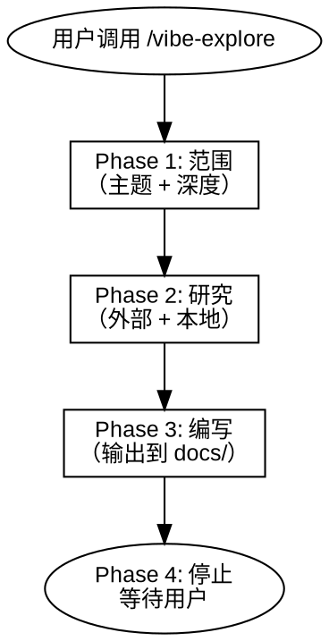

# Vibe Explore

探索与文档编写。在 `docs/` 中产出主题研究、API 参考、使用指南或学习笔记。

核心原则：
- 研究使用 context7、tavily、web reader 等工具收集上下文
- 所有输出放到 `docs/`，不放 `memory-bank`
- 交互式问答——每次只问一个问题，确认方向后再动笔
- 每次调用产出一个或多个文档，按主题组织

硬规则：
- **输出后不自动执行。** 停下来等用户指示。
- **不生成代码。** 这个技能产出文档，不产出实现代码。
- **研究前必须确认范围。** 不要在错误的主题上浪费 API 调用。



---

## 适用场景

**适用：**
- 在新项目开始前研究技术、库或框架
- 收集当前项目中不存在的背景材料和上下文
- 通过代码库分析编写使用指南、API 文档、入门文档
- 调研不熟悉的技术栈或领域
- 为团队编写参考文档
- 编写特定技术或概念的学习笔记

**不适用：**
- 设计功能（使用 /vibe-design）
- 修复 bug（使用 /vibe-hunt）
- 代码审查（使用 /vibe-review）

---

## 参考资料

| 参考文件 | 用途 |
|---------|------|
| `references/output-template.md` | 输出文档格式 |

---

## Phase 1：范围

询问用户要产出什么。先确认**文档类型**，再明确范围。

### Step 1：文档类型

| 类型 | 前缀 | 用途 | 主要来源 |
|------|------|------|---------|
| **主题研究** | `topic-` | 探索某项技术、模式或领域 | 外部（context7、tavily、web） |
| **API 参考** | `api-` | 记录模块/项目的公共 API 接口 | 本地（代码库分析） |
| **使用指南** | `guide-` | 如何安装、配置、使用项目或功能 | 本地 + 外部 |
| **学习笔记** | `notes-` | 某个概念或技术的学习笔记 | 外部 + 本地 |

使用 AskUserQuestion 确认文档类型。如果用户意图不明确，列出选项并简要说明。

### Step 2：主题与范围

根据所选文档类型，明确：

1. **主题** — 具体覆盖什么（例如 "Next.js App Router"、"当前项目的 REST API"、"实时协作模式"）
2. **深度**：

| 深度 | 标准 | 来源数 | 交叉验证 |
|------|------|--------|---------|
| **Surface** | 快速查找，单个问题 | 1-2 个来源 | 无 |
| **Standard** | 多来源研究，结构化输出 | 3-5 个来源 | 验证关键声明 |
| **Deep** | 全面研究 | 5+ 个来源 | 交叉验证所有声明 |

用户可以在一次调用中请求多个文档。每个文档产出独立文件，使用对应的类型前缀。

使用 AskUserQuestion 确认主题和深度后再开始。

---

## Phase 2：研究

根据文档类型收集信息。主题研究和学习笔记偏重外部来源；API 参考和使用指南偏重本地代码库分析。很多文档两者结合——先查本地，需要时再补充外部来源。

### 外部研究

根据需要使用可用工具：

| 工具 | 适用场景 | 使用方法 |
|------|---------|---------|
| context7 `resolve-library-id` + `query-docs` | 库/框架文档 | 先解析库 ID，再查询具体问题 |
| tavily `tavily_search` | 搜索最新信息 | 最近的资讯、对比、教程 |
| tavily `tavily_extract` | 提取特定 URL 内容 | 用户提供具体 URL 时 |
| tavily `tavily_crawl` | 多页文档站点 | 有多页的官方文档站 |
| Web reader MCP | 通用网页阅读 | tavily 无法提取的页面 |

**工作流：**

1. **先查本地** — 在项目中 grep/glob 查找已有的相关材料
2. **查询 context7** — 库/框架相关的问题
3. **搜索 tavily** — 更广泛的网络研究、对比、最新信息
4. **提取/爬取** — 从有价值的来源获取详细内容
5. **整合** — 组织发现，标注来源间的矛盾

对每个来源提取：
- 关键概念和定义
- 代码示例（如相关）
- 版本特定信息（标注版本号）
- 与其他来源的矛盾（显式标注）

**交叉验证规则（Standard+）：**
- 关键声明必须出现在至少 2 个独立来源中
- 注意版本差异——API 在不同版本间会变化
- 标注仅在单个来源中找到的信息

### 本地代码库分析

**工作流：**

1. **映射代码库** — Glob 查找文件类型，识别入口点、主模块
2. **阅读关键文件** — 入口点、导出 API、配置、类型/接口
3. **追踪模式** — 模块如何连接、数据流、常见模式
4. **识别缺口** — 读者需要知道什么？

**按文档类型分析：**

| 文档类型 | 需要阅读的关键文件 | 重点 |
|---------|-----------------|------|
| 使用指南 | README、配置文件、入口点、示例 | 安装、配置、运行 |
| API 参考 | 导出、类型、接口 | 公共 API 接口、参数、返回类型 |
| 架构概览 | 目录结构、主模块、数据流 | 组件关系、设计决策 |
| 入门指南 | 安装脚本、开发环境配置、测试 | 分步上手 |
| 学习笔记 | 所有相关模块 | 概念、模式、工作原理 |

在编写前使用 AskUserQuestion 确认分析结果——特别是架构假设或推断出的行为。

---

## Phase 3：编写输出

### 输出位置

所有输出放在项目根目录的 `docs/` 中。目录不存在则创建。

```
docs/
├── topic-xxx.md
├── api-xxx.md
├── guide-xxx.md
├── notes-xxx.md
└── ...
```

文件命名：`[前缀]-[名称].md`。前缀来自 Phase 1 的文档类型表。名称简洁且具描述性。

### 输出结构

使用 `references/output-template.md` 模板。每份文档遵循相同结构：

1. **头部** — 标题、日期、深度
2. **摘要** — 2-3 句话概述文档内容
3. **内容章节** — 按子主题或章节组织
4. **来源/参考** — 信息来源
5. **待解问题** — 仍不清楚的内容（如有）

外部研究文档包含来源 URL 及脚注。代码库分析文档列出分析的文件和模块。

---

## Phase 4：回顾与后续

展示产出摘要：

```
## 产出

主题数:         N 份文档
深度:           surface / standard / deep
输出文件:       docs/[filename-1].md, docs/[filename-2].md, ...
```

询问用户是否想要：
- 调整输出
- 延伸研究（对某个主题深入一层）
- 探索另一个主题

**停止。** 等待用户指示。

---

## 常见错误

| 错误 | 后果 | 正确做法 |
|------|------|---------|
| 跳过范围确认 | 研究错误主题，白费力气 | 开始前必须确认主题和深度 |
| 照搬来源内容 | 理解肤浅，缺少综合 | 提取关键概念，用自己的结构组织 |
| 忽略版本差异 | 对错误版本的过时建议 | 始终标注文档对应的版本 |
| 不读代码就写文档 | 不准确或误导性的文档 | 记录行为前先读实际代码 |
| 输出到 memory-bank | 与 vibe 流水线规范冲突 | 始终输出到 docs/ |
| 自动进入 vibe-design | 用户失去流程控制 | 输出后停止，等待指示 |

---

## 后续步骤

产出完成后，使用 AskUserQuestion 建议：

| 技能 | 用途 |
|------|------|
| /vibe-design | 基于研究成果开始功能设计 |
| /vibe-explore | 继续探索相关主题 |
