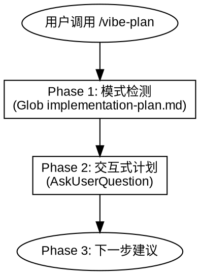
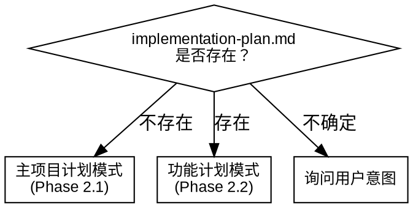

# Vibe Plan

## Overview

**Vibe Plan** 将设计文档转化为可执行的实施计划。通过交互式问答逐个探索实施维度，确保每步可验证。

核心原则：
- **Ask First** — 不假设用户偏好，先询问
- **Plan Only** — 产出文档，不包含具体代码
- **Verification** — 每步必须包含验证标准
- **Code ban** — 计划含代码会导致 AI 直接复制而非理解

智能检测：
- 无 `implementation-plan.md` → 主项目计划模式
- 已有 `implementation-plan.md` → 功能计划模式



---

## When to Use

**使用场景：**
- 主项目实施计划：从项目设计文档创建实施计划
- 功能实施计划：从功能设计文档创建实施步骤

**不适用场景：**
- 创建设计文档（使用 /vibe-design）
- 直接执行实施（使用 /vibe-iterate）

---

## References

| 参考文件 | 用途 |
|----------|------|
| `references/feature-plan-template.md` | 功能实施文档模板 |

---

## Phase 1: 检测计划上下文

```bash
Glob pattern: "memory-bank/implementation-plan.md"
```

| 检测结果 | 模式 | 动作 |
|----------|------|------|
| 文件不存在 | **主项目计划模式** | 进入 Phase 2.1 |
| 文件已存在 | **功能计划模式** | 进入 Phase 2.2 |
| 不确定 | **询问用户** | 用 AskUserQuestion 确认意图 |



---

## Phase 2: 交互式计划

交互规则：
- 使用 AskUserQuestion 逐个问题探索
- **带立场提问**：给出推荐方案和理由，让用户反驳或确认
- **显式化假设**：用户说法模糊时，说出理解并请确认
- **提供选项和权衡**：技术选型给出 2-3 个选项及优缺点
- **计划无代码**：每步只有指令，不包含实现代码
- 每个维度确认后再继续下一个

### 2.1 主项目计划模式

**读取上下文：**
- `memory-bank/feature-phases-*.md`

逐个探索以下维度：

1. **技术选型确认** — 依赖版本、兼容性、替代方案
2. **实施阶段划分** — 按功能模块或优先级拆分阶段
3. **每阶段步骤** — 拆分为可验证的具体步骤
4. **步骤依赖关系** — 哪些步骤有先后依赖

**创建文档：** `memory-bank/implementation-plan.md`

**每个步骤必须包含：**

| 字段 | 说明 |
|------|------|
| **目标** | 这步要达成什么 |
| **指令** | 具体要做的事情，不含代码 |
| **验证** | 如何验证成功，必须可编译/可测试 |

**迭代策略（内联规则）：**
- 每个功能阶段完成后，更新 `memory-bank/progress.md`
- 仅当架构发生变更时，更新 `memory-bank/feature-phases-*.md`
- 每阶段完成时，询问用户是否 git 提交

**验证：**

| 验证项 | 检查内容 |
|--------|----------|
| 可验证性 | 每步包含明确验证方式 |
| 无代码 | 计划只有指令，无实现代码 |
| 粒度适中 | 每步不过于庞大或琐碎 |

---

### 2.2 功能计划模式

**读取上下文：**
- 对应的 `memory-bank/feature-design-*.md`
- `memory-bank/implementation-plan.md`（了解已有阶段划分）

逐个探索：
1. **功能目标确认** — 这个功能要达成什么
2. **步骤拆分** — 如何拆分为可验证的步骤
3. **依赖和影响** — 需要修改/创建哪些文件
4. **验收标准** — 怎样算完成

**创建文档：** `memory-bank/feature-plan-[name].md`（模板见 `references/feature-plan-template.md`）

**验证：**

| 验证项 | 检查内容 |
|--------|----------|
| 可验证性 | 每步包含明确验证方式 |
| 无代码 | 计划只有指令，无实现代码 |
| 粒度适中 | 每步不过于庞大或琐碎 |

---

### 常见错误

| 错误 | 后果 | 正确做法 |
|------|------|----------|
| 计划包含代码 | AI 直接复制 | 严禁代码，只写指令 |
| 步骤不可验证 | 无法确认完成 | 每步必须有验证方式 |
| 一次问太多 | 用户 overwhelmed | 逐个维度探索 |

---

## Phase 3: 下一步

使用 AskUserQuestion 建议用户下一步操作：

| 技能 | 目的 |
|------|------|
| /vibe-review | 与用户确认计划 |

计划完成后**不自动执行**，等待用户指令。
