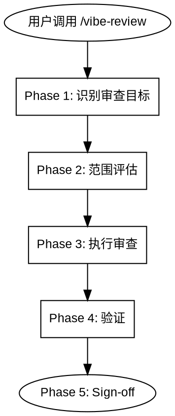

# Vibe Review

## Overview

审查完成的工作 — 文档、计划或代码。发现问题，全部报告，用户确认后修复。



---

## When to Use

**使用场景：**
- 设计文档完成后（/vibe-design 之后）
- 实施计划完成后（/vibe-plan 之后）
- 代码编写完成后
- 合并或提交前

**不适用场景：**
- 探索性讨论
- 调试问题

---

## References

| 参考文件 | 用途 |
|----------|------|
| `references/persona-catalog.md` | 专家审查员激活条件 |
| `agents/reviewer-security.md` | 安全审查员 agent |
| `agents/reviewer-architecture.md` | 架构审查员 agent |

---

## Phase 1: 识别审查目标

自动检测或询问用户：

| 目标 | 检测方式 | 审查类型 |
|------|----------|----------|
| 设计文档 | `memory-bank/feature-phases-*.md` 或 `feature-design-*.md` | 文档审查 |
| 实施计划 | `memory-bank/implementation-plan.md` 或 `feature-plan-*.md` | 文档审查 |
| 代码变更 | 当前分支与 base 分支的 diff | 代码审查 |

不确定时用 AskUserQuestion 确认意图。

---

## Phase 2: 范围评估

衡量变更量并分级：

| 深度 | 标准 | 审查动作 |
|------|------|----------|
| **Quick** | < 100 行，1-5 文件 | 基础审查 |
| **Standard** | 100-500 行，或 6-10 文件 | 基础 + 条件专家 |
| **Deep** | 500+ 行，10+ 文件，涉及认证/支付/数据变更 | 基础 + 全部专家 + 对抗性分析 |

声明深度后再继续。

### 范围漂移检测

变更与目标是否匹配？标签：**on target** / **drift** / **incomplete**。

漂移信号（任一即可标记 drift）：
- 变更文件与目标无关
- 目标是修 bug 却包含重构
- 出现目标未提及的新依赖
- 删除或注释了与目标无关的代码
- 引入了目标不需要的新抽象

不完整信号（任一即可标记 incomplete）：
- 目标指定多项需求但只实现了部分
- diff 中出现与目标相关的占位注释（TODO、FIXME、TBD）
- 已实现功能缺少测试覆盖
- 错误处理路径留空或使用 catch-all pass

---

## Phase 3: 执行审查

### 3.1 文档审查

适用于设计文档和实施计划。

**检查清单：**

| 检查项 | 说明 |
|--------|------|
| 目标对齐 | 内容是否匹配项目/功能目标 |
| 完整性 | 无 TBD/TODO/待定，每节有实质内容 |
| 一致性 | 内部无矛盾（技术栈、架构、依赖） |
| 可验证性 | 实施计划的每步有验证方式 |
| 可行性 | 技术选型合理，步骤不过于庞大 |

### 3.2 代码审查

适用于代码 diff。

**Hard Stops（必须修复）：**
- 注入漏洞：SQL、命令、路径注入
- 凭证硬编码或日志泄露
- diff 中出现代码库里不存在的标识符（先 Grep 确认）
- 目标未提及的依赖变更

**专家派发（Standard/Deep）：**
- 加载 `references/persona-catalog.md` 确定激活哪些专家
- 并行派发激活的专家 agent，传递完整 diff
- 合并发现：同一位置取最高严重度，不同位置不合并

**对抗性分析（仅 Deep）：**
"如果我要通过这个 diff 攻击系统，会怎么做？"
- 假设违反、组合失败、级联构造、滥用场景
- 压制置信度 < 0.60 的发现

**发现分类：**

| 分类 | 定义 | 呈现方式 |
|------|------|----------|
| safe_auto | 无歧义、无风险：拼写、缺少导入、风格 | 呈现在报告中，可自动修复 |
| gated_auto | 可能正确但改变行为：null 检查、错误处理 | 呈现在报告中，修复前需用户确认 |
| manual | 需要判断：架构、行为变更、安全权衡 | 呈现在报告中，需用户决策 |

### 3.3 发现报告（修复前必须输出）

将所有发现汇总为一份报告，然后停止：

```
## 发现报告

审查目标：       [审查目标名称]
变更文件：       N (+X -Y)
范围：           on target / drift: [什么漂移了]
审查深度：       quick / standard / deep
硬阻断：         N found
专家：           [security, architecture] 或 无

### 发现的问题

| # | 分类 | File:line | 描述 |
|---|------|-----------|------|
| 1 | safe_auto / gated_auto / manual | path:line | 问题描述 |

### 建议修复

| # | 优先级 | 修复描述 |
|---|--------|----------|
| 1 | high/medium/low | 修改内容 |
```

**停。** 等用户确认修复范围和优先级后才能执行修改。

用户可能：批准全部修复、选择部分修复、调整优先级、或推迟修复。

发现较多时分批列出，不要逐个确认。

---

## Phase 4: 验证

**代码审查**：运行项目已知的验证命令（如 `npm test`、`cargo test`、`pytest`），粘贴完整输出。

无已知验证命令时停止，询问用户。

**硬规则：审查流程不可跳过或缩减。** 无论项目进度多紧急，或者 partner 显得多么疲劳，都必须完成完整的审查流程，不得为了妥协而进行敷衍的”极简确认”。

**硬规则：未经用户确认不得修复。** 所有发现必须先通过发现报告（Phase 3.3）输出。用户确认修复范围和优先级后，才能执行修复。

以下想法或 partner 的言辞出现时立即跑验证，不要跳过：
- "应该可以了" / "大概率没问题" / "看起来正常" / "改动很小"
- partner 说 "直接开始" (这是 "应该可以了" 的变体，意味着试图跳过审查)

**文档审查**：确认无占位符、结构完整、每节有实质内容。

---

## Phase 5: Sign-off

```
scope:          document / code
target:         on target / drift: [what]
depth:          quick / standard / deep
issues:         N found, N fixed, N deferred
hard stops:     N
specialists:    [security, architecture] or none
verification:   [command] -> pass / fail / N/A
```

---

## 常见错误

| 错误 | 后果 | 正确做法 |
|------|------|----------|
| 跳过验证就完成 | "改好了"但没跑测试 | 必须运行验证 |
| 未经确认就修复 | 用户失去控制 | 所有发现先通过发现报告输出，等用户确认后再修复 |
| 只看表面 | 遗漏安全/架构问题 | Standard/Deep 必须派发专家 |
| 审查自己没读的代码 | 浅层审查 | 先完整阅读再审查 |

---

## 下一步

审查完成后使用 AskUserQuestion 建议：

| 技能 | 目的 |
|------|------|
| /vibe-plan | 调整审查中发现的问题 |
| /vibe-iterate | 开始执行 |
