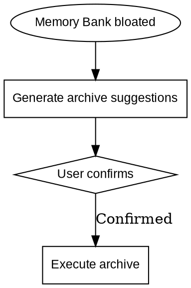

# Vibe Archive

## Overview

Memory Bank archiving skill. When memory-bank content becomes bloated, analyze current state and safely archive completed tasks and features.

**Core principle: Smart analysis, suggest first, safe archiving.**

---

## When to Use



**Trigger conditions (any one triggers):**
- `progress.md`: > 50 steps
- `memory-bank/plans/feature-plan-*.md`: > 5 completed features
- `memory-bank/plans/feature-phases-*-g*-plan.md`: > 3 completed group plans

**Do not archive:**
- Main design document (`memory-bank/designs/feature-phases-*.md`) — always keep
- Architecture document (`memory-bank/architecture.md`) — always keep
- Tech stack document (`memory-bank/tech-stack.md`) — always keep
- In-progress feature documents (incomplete `memory-bank/plans/feature-plan-*.md`)
- In-progress group plan files (incomplete `memory-bank/plans/feature-phases-*-g*-plan.md`)

---

## Execution Flow

### Step 1: Analyze Memory Bank State

Analyze the following:
1. Count `progress.md` lines and date range
2. Scan `memory-bank/plans/feature-plan-*.md` files, identify completed and in-progress features
3. Scan `memory-bank/plans/feature-phases-*-g*-plan.md` files, identify completed group plans
4. Assess whether archiving is needed

### Step 2: Generate Archive Suggestions

Output current state statistics and archiving suggestions.

- **Threshold reached**: ✅ Suggest archiving, list specific benefits
- **Threshold not reached**: ⚠️ Warn "current project scale is small, archiving may cause context fragmentation", use AskUserQuestion to confirm (options: cancel / force archive)

### Step 3: Confirm Archive Plan

Use AskUserQuestion to confirm archiving scope.

### Step 4: Execute Archive

**Archive directory structure:**

```
memory-bank/archive/
├── progress/
│   └── progress-archive-YYYY-MM-DD.md
├── features/
│   └── features-archive-YYYY-MM-DD.md
├── plans/
│   └── plans-archive-YYYY-MM-DD.md
└── archived-items.md
```

**Steps:**
1. Create archive directories
2. Move completed files to archive directory
3. Create/update `memory-bank/archive/archived-items.md` index
4. Update `progress.md` (keep most recent 50 steps)

**Index template:**

```markdown
# Memory Bank Archive Index

> Last updated: YYYY-MM-DD

| Archive date | Archive file | Content summary |
|-------------|-------------|-----------------|
| YYYY-MM-DD | progress-archive-YYYY-MM-DD.md | Completed steps from progress.md [date range] |
| YYYY-MM-DD | features-archive-YYYY-MM-DD.md | [Feature name list] |
| YYYY-MM-DD | plans-archive-YYYY-MM-DD.md | Group plans [1-N] |
```

### Step 5: Verify

| Check | Content |
|-------|---------|
| Archive completeness | Archive files created correctly |
| Index completeness | archived-items.md index is complete |
| In-progress content | In-progress content is unaffected |
| Main design document | `memory-bank/designs/feature-phases-*.md` was not moved |
| Architecture/tech-stack docs | architecture.md and tech-stack.md were not moved |

---

## Common Mistakes

| Mistake | Consequence | Correct approach |
|---------|-------------|------------------|
| Archive main design document | Lost core context | Main design document, architecture.md, and tech-stack.md are always kept |
| Archive incomplete features | Feature information lost | Only archive completed features |
| Skip user confirmation | Accidentally delete important files | Must wait for user confirmation |

---

## Notes

- Archived files are stored in `memory-bank/archive/`, the iteration skill (vibe-iterate) does not read archive records
- Archiving is a one-way operation, confirm scope before executing
