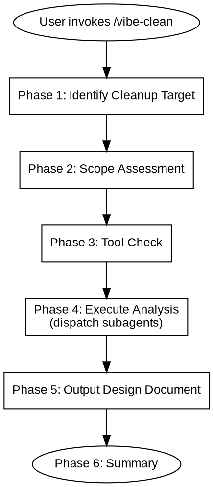

# Vibe Clean

## Overview

Analyze code for cleanup opportunities and output a design document. Does not modify code — findings become a `feature-design-clean-*.md` that feeds into `/vibe-plan` → `/vibe-iterate`.

Core principles:
- Subagents are read-only analyzers — they identify issues, they don't fix them
- Output follows vibe-design document format for pipeline compatibility
- No auto-execution — user controls all next steps

Hard rules:
- **Detection tools must be installed before analysis.** If a tool is missing, stop and prompt the user to install it. Do not silently fall back to grep.
- **Subagents are read-only.** They report findings, they don't edit code.
- **Output is a design document.** Actual cleanup goes through vibe-plan → vibe-iterate.



---

## When to Use

**Use cases:**
- Project has accumulated dead code, unused dependencies, or duplicate logic
- After a major refactoring or feature removal
- Before a release to reduce bundle size and technical debt
- Periodic codebase health check

**Not for:**
- Debugging issues (use /vibe-hunt)
- Designing new features (use /vibe-design)
- Reviewing code quality (use /vibe-review)
- Performance optimization

---

## References

| Reference file | Purpose |
|----------------|---------|
| `references/cleanup-catalog.md` | Subagent activation conditions by depth |
| `agents/simplification-analyzer.md` | Code simplification analysis agent |
| `agents/dead-code-analyzer.md` | Dead code detection agent |
| `agents/duplicate-analyzer.md` | Duplicate code detection agent |

---

## Phase 1: Identify Cleanup Target

Auto-detect or ask user:

| Target | Detection method | Scope |
|--------|-----------------|-------|
| Changed files | Diff between current branch and base branch | Branch diff only |
| Specific paths | User provides directory or file globs | User-specified scope |
| Full project | User explicitly requests | Entire codebase (use with caution) |

Default: changed files on current branch. Use AskUserQuestion to confirm when ambiguous.

---

## Phase 2: Scope Assessment

Measure target size and classify:

| Depth | Criteria | Activated agents |
|-------|----------|-----------------|
| **Surface** | < 50 lines, 1-5 files | `simplification-analyzer` only |
| **Standard** | 50-200 lines, or 6-15 files | + `dead-code-analyzer` |
| **Deep** | 200+ lines, 15+ files, or user requests comprehensive cleanup | + `duplicate-analyzer` |

Declare depth before proceeding.

---

## Phase 3: Tool Check

Check for detection tools based on project type:

| Tool | Language | Check command | Install command |
|------|----------|---------------|-----------------|
| knip | JS/TS | `npx knip --version` | `npm install -D knip` |
| depcheck | JS/TS | `npx depcheck --version` | `npm install -D depcheck` |
| ts-prune | TypeScript | `npx ts-prune --version` | `npm install -D ts-prune` |
| vulture | Python | `vulture --version` | `pip install vulture` |
| deadcode | Go | `deadcode -h` | `go install golang.org/x/tools/cmd/deadcode@latest` |
| cargo-udeps | Rust | `cargo udeps --version` | (built into cargo nightly) |

**If a required tool is not installed:**
1. Stop analysis
2. Tell the user which tool is missing and the install command
3. Ask whether to: (a) install and continue, (b) skip this tool, or (c) abort

Do not silently fall back to grep-based detection.

---

## Phase 4: Execute Analysis

### Subagent Dispatch

Load `references/cleanup-catalog.md` to confirm activation conditions. Dispatch activated agents **in parallel**, passing:
- Target scope (file list or diff)
- Project type and language
- Any tool output already available

### Finding Categories

Each agent categorizes its findings:

| Category | Definition | Example |
|----------|------------|---------|
| SAFE | Unused, unreferenced, no dynamic consumers | Unused private function, stray console.log |
| CAUTION | May have dynamic or indirect consumers | Component in route config, middleware in array |
| DANGER | Public API, config, entry points | Exported utility, barrel export, config constant |

### Consolidation Rules

- Same location flagged by multiple agents: merge, keep highest severity
- Different locations: keep separate
- Deduplicate across agents (same finding from different tools)

---

## Phase 5: Output Design Document

Consolidate all findings into `memory-bank/designs/feature-design-clean-[name].md`.

Follow the feature-design template format:

- **Architecture Overview**: Reference existing architecture.md, describe cleanup scope
- **Phases**: One phase per cleanup category (only include phases with findings)
  - Phase 0: Surface cleanup (unused imports, console.logs, commented-out code)
  - Phase 1: Dead code removal (unused exports, functions, dependencies)
  - Phase 2: Code simplification (conditionals, naming, structure)
  - Phase 3: Duplicate consolidation (near-duplicate functions, redundant types)
- **Phase Details**: Specific files and findings, categorized by safety tier (SAFE/CAUTION/DANGER)
- **Plan Groups**: Grouped by directory or module coupling
- **Acceptance Criteria**: Tests pass, build succeeds, bundle size reduced (if applicable)

Each phase's verification: run project test suite → all pass.

---

## Phase 6: Summary

```
## Cleanup Analysis

Target:          [cleanup target description]
Scope:           N files, N lines analyzed
Depth:           surface / standard / deep
Agents used:     [simplification, dead-code, duplicate]

### Findings Summary

| Category | SAFE | CAUTION | DANGER | Total |
|----------|------|---------|--------|-------|
| Dead code | N | N | N | N |
| Simplification | N | - | - | N |
| Duplicates | N | N | - | N |

### Output

Design document: memory-bank/designs/feature-design-clean-[name].md
```

**Stop.** Wait for user to review the design document and decide next steps.

---

## Common Mistakes

| Mistake | Consequence | Correct approach |
|---------|-------------|------------------|
| Skip tool check | Analysis runs without proper tools, incomplete results | Always check and prompt for installation |
| Subagents modify code | Unverified changes in codebase | Subagents are read-only analyzers |
| Output non-standard format | vibe-plan cannot parse the document | Follow feature-design template |
| Analyze entire codebase by default | Slow, overwhelming results | Default to branch diff, full scan only on explicit request |
| Silent fallback to grep | False positives from missed dynamic imports | Prompt user when tools are missing |

---

## Next Steps

After design document is generated, use AskUserQuestion to suggest:

| Skill | Purpose |
|-------|---------|
| /vibe-plan | Create implementation plans from the cleanup design |
| /vibe-design | Adjust or expand the cleanup design |
