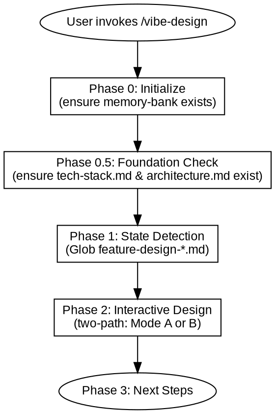
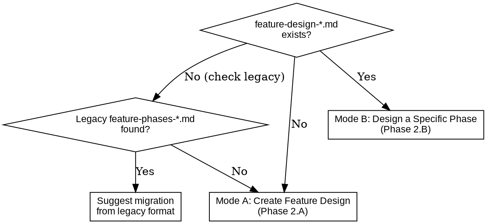

# Vibe Design

## Overview

**Vibe Design** transforms user ideas into feature design documents through interactive Q&A (one question at a time). A single `feature-design-*.md` document contains both the phased feature list and per-phase design details. Design only — no bug fixes, no auto-execution after design is complete.

Core principles:
- Use AskUserQuestion to ask questions one at a time, exploring requirements section by section
- Wait for user confirmation after each question before proceeding
- After design is complete, wait for user instruction or user to invoke /vibe-plan

Hard rules:
- **tech-stack.md and architecture.md must exist before any design work.** If either is missing, create or supplement them first. This is a blocking check — no design work proceeds without both files.
- **Initialization must happen before any code is written.** Regardless of project urgency, scale, or partner opinion. Without the memory-bank structure, all subsequent vibe skills will fail.
- **If memory-bank is missing, pause coding immediately.** Already-written code is not lost, but it must be brought under the memory-bank management structure before continuing.

Smart detection:
- No `feature-design-*.md` → Create new feature design document (Mode A)
- `feature-design-*.md` exists → Design a specific phase (Mode B)
- Legacy `feature-phases-*.md` found without `feature-design-*.md` → Suggest migration



---

## When to Use

**Use cases:**
- Create a feature design document with phased breakdown for a project or feature set
- Design individual phases within an existing feature design document
- Reference external documents (migration guides, technical plans) to build designs

**Not for:**
- Fixing bugs or debugging issues
- Auto-executing subsequent steps

---

## References

| Reference file | Purpose |
|----------------|---------|
| `references/interaction-principles.md` | Core Q&A and design presentation principles |
| `references/feature-design-template.md` | Feature design document template (includes phases) |
| `references/architecture-template.md` | Architecture document template |
| `references/tech-stack-template.md` | Tech stack document template |

---

## Phase 0: Initialize

Check if a `memory-bank` folder exists in the project root. Create it if it does not.

---

## Phase 0.5: Foundation Check

Read `memory-bank/architecture.md` and `memory-bank/tech-stack.md`. Both must exist before proceeding.

```bash
Glob pattern: "memory-bank/architecture.md"
Glob pattern: "memory-bank/tech-stack.md"
```

| Detection result | Action |
|-----------------|--------|
| Both exist | Confirm with user whether they still reflect current state. If yes, proceed to Phase 1 |
| One or both missing | Enter foundation creation flow (Steps below) |

**Foundation creation flow:**

Interactive Q&A to explore architecture dimensions one by one (only for missing or outdated documents):
1. **Purpose and scope** — One-sentence project purpose, in/out of scope
2. **Architecture diagram** — ASCII diagram or description of component relationships, component responsibilities
3. **Directory structure** — Planned file layout
4. **Tech stack** — Languages, frameworks, tools, versions, why chosen
5. **External services** — Third-party APIs, SDKs, constraints

Confirm each dimension before proceeding.

Generate documents:
- `memory-bank/architecture.md` (template: `references/architecture-template.md`)
- `memory-bank/tech-stack.md` (template: `references/tech-stack-template.md`)

These are single source of truth for the project's architecture and technology choices. All feature-design documents reference them.

---

## Phase 1: State Detection

```bash
Glob pattern: "memory-bank/designs/feature-design-*.md"
Glob pattern: "memory-bank/designs/feature-phases-*.md"
```



**Legacy migration:** If `feature-phases-*.md` is found without a corresponding `feature-design-*.md`, suggest the user merge the legacy document into the new `feature-design-*.md` format. Provide guidance: copy phases table, phase details, and plan groups from the legacy file, then add Phase Designs sections.

---

## Phase 2: Interactive Design

All Q&A follows `references/interaction-principles.md`. Key rules:

- One question at a time via AskUserQuestion. Prefer structured options over open-ended.
- Present design in small paragraphs (200-300 words). Confirm direction after each.
- Offer 2-3 alternatives with tradeoffs for every decision. State the recommendation.
- Strict YAGNI: cut features nobody asked for.
- No placeholders (TBD/TODO) in output documents.
- Confirm each dimension before moving to the next. Backtrack freely if user feedback changes direction.

### Mode A: Create Feature Design Document

Always produces `feature-design-[name].md`. This is the entry point for any new design work. The document contains both the phases overview and per-phase design sections.

**Step 1: Understand the Need**

Analyze user's input to understand what they want to build:
- Check for reference documents (file paths, `refs/` directory)
- Read any provided reference material, extract key info: goals, tech stack, existing phase breakdown, dependencies
- Confirm understanding with the user

If no reference document:
- Q&A to explore: what is the goal, what exists already, what is the tech context
- Present your understanding in a summary paragraph (200-300 words) and confirm

**Step 2: Phase Breakdown**

Present the phase breakdown. Each phase must be independently compilable and verifiable:
1. Present phase list with: name, goal, dependencies, verification strategy
2. Confirm each phase with the user
3. Allow adjustment: merge, split, reorder phases
4. All phases start with status `pending`

**Step 2.5: Plan Grouping**

After phase breakdown is confirmed, evaluate how phases should be grouped into implementation plans. Complex projects produce multiple plan files; simple ones may use a single plan.

**Analysis signals:**
1. Adjacent phases sharing >2 files → group together
2. Phase B fully depends on Phase A's output → group together
3. Single phase with <3 steps and no independent verification value → merge with adjacent
4. Phases independently compilable and verifiable → keep separate

**Process:**
1. Analyze phase dependencies, shared files, and complexity
2. Suggest grouping: `| Group | Phases | Rationale |`
3. Interactive Q&A: user accepts, adjusts, or overrides
4. Store grouping in Plan Groups section

**Example output:**
```
| Group | Phases | Rationale |
|-------|--------|-----------|
| G1 | Phase 0, Phase 1 | Foundation setup, shared config |
| G2 | Phase 2, Phase 3 | Core feature, shared data model |
| G3 | Phase 4 | Independent enhancement |
```

**Step 3: Document Generation**

Generate `memory-bank/designs/feature-design-[name].md` (template: `references/feature-design-template.md`). The document includes:
- Architecture Overview (references architecture.md and tech-stack.md)
- Phases table + Phase Details
- Plan Groups
- Phase Designs sections (empty placeholders for Mode B to fill)

**Step 3.5: Pre-fill Known Designs**

If any phase has obvious, well-understood design (e.g., simple utility, boilerplate setup), ask user if they want to pre-fill the Phase Design section for that phase during Mode A. Default is to leave empty for Mode B.

### Mode B: Design a Specific Phase

For: `feature-design-*.md` exists, user wants to design one or more phases in detail.

**Step 1: Phase Status Display**

Read phases list from `feature-design-*.md`, check which Phase Designs sections have content, display phase status:

```
| Phase | Name | Status |
|-------|------|--------|
| Phase 0 | NPY Reader | done |
| Phase 1 | EmbeddingStore | designing |
| Phase 2 | Prefill Builder | pending |
| ... | ... | ... |
```

**Step 2: Phase Selection**

Ask user which phase to design. Default recommendation: next pending phase in order. User may also specify any phase.

**Step 3: Feature Design Q&A**

Explore the selected phase's requirements one by one:
1. **Feature name and goals** — What should this phase accomplish (can auto-fill from phase description)
2. **Implementation approach and tradeoffs** — 2-3 alternative approaches, pros and cons
3. **Files to create / modify** — Impact scope
4. **Key technical details** — Interfaces, data structures, algorithms (only if relevant)
5. **Verification strategy** — How to test this phase independently

**Step 4: Document Update**

Fill in the corresponding Phase Design section in `feature-design-*.md` with:
- Design Approach (summary, comparison, technical considerations)
- User Interaction (story, flow)
- Acceptance Criteria (testable)

Then update the phase status in the Phases table from `pending` to `designing`.

**Step 5: Continue Next Phase**

After completion, ask user if they want to continue designing the next phase. If yes, return to Step 2. If no, proceed to Phase 3.

---

## Phase 3: Next Steps

Use AskUserQuestion to suggest next steps:

| Skill | Purpose |
|-------|---------|
| /vibe-plan | Create implementation plan for a designed phase |
| /vibe-design | Continue designing next phase |

After design is complete, **do not auto-execute anything** — wait for user instruction.

---

## Status Lifecycle

Documents track implementation progress through status values:

| Document | Status field | Values |
|----------|-------------|--------|
| `feature-design-*.md` Phases table | Per-phase status column | `pending` → `designing` → `done` |
| `feature-design-*.md` Phase Designs | Section content | Empty → Filled |

**Who updates status:**
- `pending` → `designing`: vibe-design (Mode B Step 4, when Phase Design section is filled)
- `designing` → `done`: vibe-iterate (after completing all steps for that phase's group)
- Phase Design content: vibe-design fills it, vibe-iterate marks it done

---

## Common Mistakes

| Mistake | Consequence | Correct approach |
|---------|-------------|------------------|
| Skip tech-stack/architecture check | Design without tech context | Must verify both files exist before any design work |
| Skip interaction, output directly | Low design quality | Must explore questions one at a time before generating document |
| Auto-execute after design | User loses control | Stop after design, wait for instructions |
| Non-standard file naming | Subsequent skills can't find documents | Strictly use feature-design- prefix |
| Copy reference document directly | Missing user intent confirmation | Reference document is input only, must confirm through Q&A |
| Design all phases at once | User overwhelmed | Design one phase at a time, confirm before proceeding |
| Forget to update Phases table status | Status table goes stale | Always update status when filling Phase Design sections |
