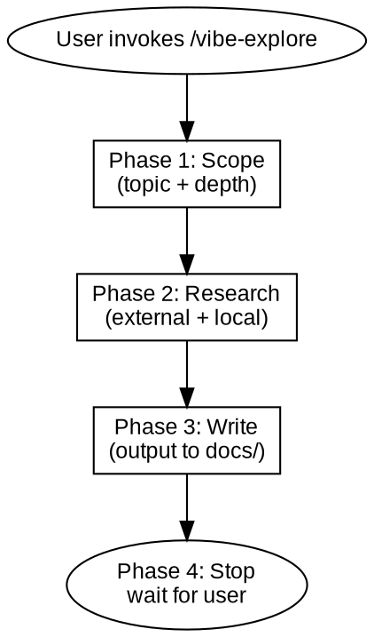

# Vibe Explore

Exploration and documentation writing. Produces organized documents in `docs/` — topic research, API references, usage guides, or learning notes.

Core principles:
- Research uses context7, tavily, web reader, and standard tools to gather context
- All output goes to `docs/`, never `memory-bank`
- Interactive Q&A — one question at a time, confirm direction before writing
- Each invocation outputs one or more documents, organized by topic

Hard rules:
- **No auto-execution after output.** Stop and wait for user instruction.
- **No code generation.** This skill produces documents, not implementation code.
- **Always confirm scope before research.** Don't burn API calls on the wrong topic.
- **All document content must cite sources.** Every claim, finding, or technical detail drawn from external materials must reference its source (URL, `refs/` file). Append a reference list at the end of the document. Follow the principle: explore and collect first → write document → verify against sources.



---

## When to Use

**Use cases:**
- Research technologies, libraries, or frameworks before starting a new project
- Collect background materials and context that don't exist in the current project
- Write usage guides, API documentation, onboarding docs from codebase analysis
- Investigate an unfamiliar tech stack or domain
- Produce reference documents for team onboarding
- Write learning notes on a specific technology or concept

**Not for:**
- Designing features (use /vibe-design)
- Fixing bugs (use /vibe-hunt)
- Code review (use /vibe-review)

---

## References

| Reference file | Purpose |
|----------------|---------|
| `references/output-template.md` | Output document format |

---

## Phase 1: Scope

Ask the user what they want to produce. First clarify **doc type**, then scope.

### Step 1: Doc Type

| Type | Prefix | Purpose | Primary sources |
|------|--------|---------|-----------------|
| **Topic research** | `topic-` | Explore a technology, pattern, or domain | External (context7, tavily, web) |
| **API reference** | `api-` | Document public API surface of a module/project | Local (codebase analysis) |
| **Usage guide** | `guide-` | How to install, configure, use the project or a feature | Local + external |
| **Learning notes** | `notes-` | Study notes on a concept or technology | External + local |

Use AskUserQuestion to confirm the doc type. If the user's intent is ambiguous, list the options with brief descriptions.

### Step 2: Topic and Scope

Based on the chosen doc type, clarify:

1. **Topic** — What specifically to cover (e.g., "Next.js App Router", "current project's REST API", "real-time collaboration patterns")
2. **Depth**:

| Depth | Criteria | Sources | Cross-validation |
|-------|----------|---------|------------------|
| **Surface** | Quick lookup, single question | 1-2 sources | None |
| **Standard** | Multi-source research, structured output | 3-5 sources | Verify key claims |
| **Deep** | Comprehensive research | 5+ sources | Cross-validate all claims |

The user may request multiple documents in one invocation. Each produces a separate file with its type prefix.

Use AskUserQuestion to confirm topic and depth before proceeding.

---

## Phase 2: Research

Gather information based on doc type. Topic research and learning notes lean on external sources; API references and usage guides lean on local codebase analysis. Many documents combine both — start local, supplement with external when needed.

### External Research

Use available tools based on what's needed:

| Tool | Best for | How to use |
|------|----------|------------|
| context7 `resolve-library-id` + `query-docs` | Library/framework documentation | Resolve library ID first, then query specific questions |
| tavily `tavily_search` | Web search for current information | For recent articles, comparisons, tutorials |
| tavily `tavily_extract` | Extract content from specific URLs | When user provides specific URLs |
| tavily `tavily_crawl` | Multi-page documentation sites | For official docs sites with multiple pages |
| Web reader MCP | General web page reading | For pages that tavily can't extract |

**Workflow:**

1. **Check local first** — grep/glob the project for existing materials on the topic
2. **Query context7** — for library/framework-specific questions
3. **Search tavily** — for broader web research, comparisons, recent information
4. **Extract/crawl** — for detailed content from promising sources
5. **Consolidate** — organize findings, note contradictions between sources

For each source, extract:
- Key concepts and definitions
- Code examples (if relevant)
- Version-specific information (note the version)
- Contradictions with other sources (flag explicitly)

**Cross-validation rules (Standard+):**
- Key claims must appear in at least 2 independent sources
- Note version differences — APIs change between versions
- Flag anything found in only a single source

### Local Codebase Analysis

**Workflow:**

1. **Map the codebase** — Glob for file types, identify entry points, main modules
2. **Read key files** — Entry points, exported APIs, configuration, types/interfaces
3. **Trace patterns** — How modules connect, data flow, common patterns
4. **Identify gaps** — What would a reader need to know?

**Analysis targets by doc type:**

| Doc type | Key files to read | Focus |
|----------|-------------------|-------|
| Usage guide | README, config files, entry points, examples | How to install, configure, run |
| API reference | Exports, types, interfaces | Public API surface, parameters, return types |
| Architecture overview | Directory structure, main modules, data flow | Component relationships, design decisions |
| Onboarding guide | Setup scripts, dev environment config, tests | Step-by-step getting started |
| Learning notes | All relevant modules | Concepts, patterns, how things work |

Use AskUserQuestion to confirm findings before writing — especially for architecture assumptions or inferred behavior.

---

## Phase 3: Write Output

### Output Location

All output goes to `docs/` in the project root. Create the directory if it doesn't exist.

```
docs/
├── topic-xxx.md
├── api-xxx.md
├── guide-xxx.md
├── notes-xxx.md
└── ...
```

File naming: `[prefix]-[name].md`. Prefix from doc type table in Phase 1. Name is descriptive and concise.

### Output Structure

Use template from `references/output-template.md`. Every document follows the same structure:

1. **Header** — Title, date, depth
2. **Summary** — 2-3 sentence overview of what this document covers
3. **Content sections** — Main body organized by subtopic or chapter
4. **Sources / References** — Where information came from
5. **Open Questions** — What remains unclear (if any)

External research documents include source URLs with footnotes. Codebase analysis documents list files and modules analyzed.

---

## Phase 4: Review and Next Steps

Present a summary of what was produced:

```
## Output

Topics:         N document(s)
Depth:          surface / standard / deep
Output:         docs/[filename-1].md, docs/[filename-2].md, ...
```

Ask user if they want to:
- Adjust the output
- Extend the research (go deeper on a topic)
- Explore another topic

**Stop.** Wait for user instruction.

---

## Common Mistakes

| Mistake | Consequence | Correct approach |
|---------|-------------|------------------|
| Skip scope confirmation | Research on wrong topic, wasted effort | Always confirm topic and depth before starting |
| Copy-paste from sources | Shallow understanding, missing synthesis | Extract key concepts, organize in your own structure |
| Ignore version differences | Outdated advice for wrong version | Always note which version docs refer to |
| Write docs without reading code | Inaccurate or misleading documentation | Read actual code before documenting behavior |
| Output to memory-bank | Conflicts with vibe pipeline conventions | Always output to docs/ |
| Auto-proceed to vibe-design | User loses control of flow | Stop after output, wait for instruction |

---

## Next Steps

After output is generated, use AskUserQuestion to suggest:

| Skill | Purpose |
|-------|---------|
| /vibe-design | Start designing a feature based on research findings |
| /vibe-explore | Continue exploring a related topic |
