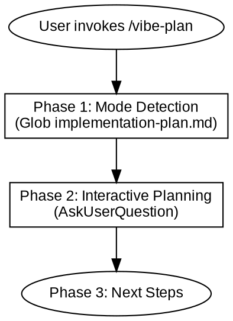
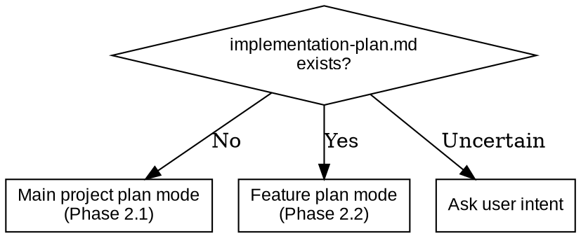

# Vibe Plan

## Overview

**Vibe Plan** converts design documents into executable implementation plans. Uses interactive Q&A to explore implementation dimensions one at a time, ensuring every step is verifiable.

Core principles:
- **Ask First** — Do not assume user preferences, ask first
- **Plan Only** — Output documents, no concrete code
- **Verification** — Every step must include verification criteria
- **Code ban** — Plans containing code cause AI to copy instead of understand

Smart detection:
- No `implementation-plan.md` → Main project plan mode
- `implementation-plan.md` exists → Feature plan mode



---

## When to Use

**Use cases:**
- Main project implementation plan: create from project design document
- Feature implementation plan: create implementation steps from feature design document

**Not for:**
- Creating design documents (use /vibe-design)
- Directly executing implementation (use /vibe-iterate)

---

## References

| Reference file | Purpose |
|----------------|---------|
| `references/feature-plan-template.md` | Feature implementation document template |

---

## Phase 1: Detect Plan Context

```bash
Glob pattern: "memory-bank/implementation-plan.md"
```

| Detection result | Mode | Action |
|------------------|------|--------|
| File does not exist | **Main project plan mode** | Enter Phase 2.1 |
| File exists | **Feature plan mode** | Enter Phase 2.2 |
| Uncertain | **Ask user** | Use AskUserQuestion to confirm intent |



---

## Phase 2: Interactive Planning

Interaction rules:
- Use AskUserQuestion to explore one question at a time
- **Ask with a position**: give recommended approach with reasons, let the user challenge or confirm
- **Make assumptions explicit**: when the user is vague, state your understanding and ask for confirmation
- **Offer options and tradeoffs**: present 2-3 options with pros and cons for technical decisions
- **No code in plans**: each step contains only instructions, no implementation code
- Confirm each dimension before moving to the next

### 2.1 Main Project Plan Mode

**Read context:**
- `memory-bank/feature-phases-*.md`

Explore the following dimensions one by one:

1. **Tech stack confirmation** — Dependency versions, compatibility, alternatives
2. **Implementation phase breakdown** — Split into phases by feature module or priority
3. **Steps per phase** — Break into verifiable concrete steps
4. **Step dependencies** — Which steps have sequential dependencies

**Create document:** `memory-bank/implementation-plan.md`

**Every step must include:**

| Field | Description |
|-------|-------------|
| **Goal** | What this step should accomplish |
| **Instructions** | What to do specifically, no code |
| **Verification** | How to verify success, must be compilable/testable |

**Iteration strategy (inline rules):**
- After each feature phase is complete, update `memory-bank/progress.md`
- Only update `memory-bank/feature-phases-*.md` when architecture changes
- At the end of each phase, ask user whether to git commit

**Validation:**

| Check | Content |
|-------|---------|
| Verifiability | Each step includes a clear verification method |
| No code | Plan contains only instructions, no implementation code |
| Appropriate granularity | Each step is neither too large nor too granular |

---

### 2.2 Feature Plan Mode

**Read context:**
- Corresponding `memory-bank/feature-design-*.md`
- `memory-bank/implementation-plan.md` (to understand existing phase breakdown)

Explore one by one:

1. **Feature goal confirmation** — What should this feature accomplish
2. **Step breakdown** — How to split into verifiable steps
3. **Dependencies and impact** — Which files need to be modified/created
4. **Acceptance criteria** — What counts as done

**Create document:** `memory-bank/feature-plan-[name].md` (template see `references/feature-plan-template.md`)

**Validation:**

| Check | Content |
|-------|---------|
| Verifiability | Each step includes a clear verification method |
| No code | Plan contains only instructions, no implementation code |
| Appropriate granularity | Each step is neither too large nor too granular |

---

### Common Mistakes

| Mistake | Consequence | Correct approach |
|---------|-------------|------------------|
| Plan contains code | AI copies directly | Strictly no code, instructions only |
| Steps are unverifiable | Cannot confirm completion | Every step must have a verification method |
| Ask too much at once | User gets overwhelmed | Explore one dimension at a time |

---

## Phase 3: Next Steps

Use AskUserQuestion to suggest next steps:

| Skill | Purpose |
|-------|---------|
| /vibe-review | Confirm plan with user |

After plan is complete, **do not auto-execute** — wait for user instruction.
