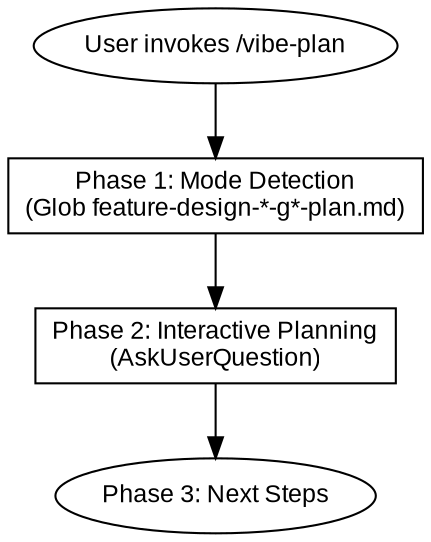
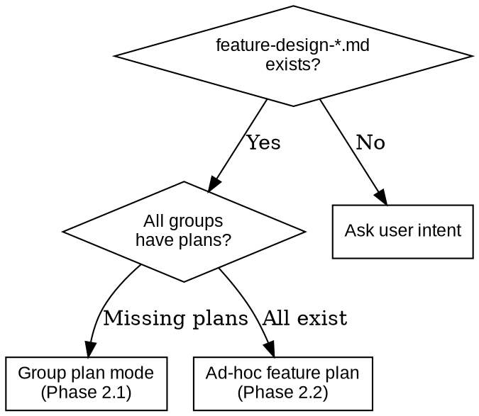

# Vibe Plan

## Overview

**Vibe Plan** converts design documents into executable implementation plans. Uses interactive Q&A to explore implementation dimensions one at a time, ensuring every step is verifiable.

Core principles:
- **Ask First** — Do not assume user preferences, ask first
- **Plan Only** — Output documents, no concrete code
- **Verification** — Every step must include verification criteria
- **Code ban** — Plans containing code cause AI to copy instead of understand

Smart detection:
- `feature-design-*-g*-plan.md` not found for a group → Group plan mode (create plan for that group)
- All group plans exist → Ad-hoc feature plan mode (create standalone feature plan)



---

## When to Use

**Use cases:**
- Main project implementation plan: create from feature design document
- Feature implementation plan: create implementation steps from a specific phase design

**Not for:**
- Creating design documents (use /vibe-design)
- Directly executing implementation (use /vibe-iterate)

---

## References

| Reference file | Purpose |
|----------------|---------|
| `references/feature-plan-template.md` | Feature implementation document template |

---

## Phase 1: Detect Plan Context

```bash
Glob pattern: "memory-bank/plans/feature-design-*-g*-plan.md"
Glob pattern: "memory-bank/designs/feature-design-*.md"
```

**Step 1:** Read `feature-design-*.md` to extract Plan Groups section.

**Step 2:** Check which groups already have plan files. For each group, check if `feature-design-[name]-g[N]-plan.md` exists.

| Detection result | Mode | Action |
|------------------|------|--------|
| Group(s) without plan files | **Group plan mode** | Enter Phase 2.1 for each missing group |
| All groups have plans | **Ad-hoc feature plan mode** | Enter Phase 2.2 |
| No `feature-design-*.md` found | **Ask user** | Use AskUserQuestion to confirm intent |



**Naming convention:**
- Group plans: `memory-bank/plans/feature-design-[name]-g[N]-plan.md`
- Example: `feature-design-messaging.md` G1 → `feature-design-messaging-g1-plan.md`

---

## Phase 2: Interactive Planning

Interaction rules:
- Use AskUserQuestion to explore one question at a time
- **Ask with a position**: give recommended approach with reasons, let the user challenge or confirm
- **Make assumptions explicit**: when the user is vague, state your understanding and ask for confirmation
- **Offer options and tradeoffs**: present 2-3 options with pros and cons for technical decisions
- **No code in plans**: each step contains only instructions, no implementation code
- Confirm each dimension before moving to the next

### 2.1 Group Plan Mode

**Read context:**
- `memory-bank/designs/feature-design-*.md` (Plan Groups section + Phases table + Phase Designs)
- `memory-bank/architecture.md`
- `memory-bank/tech-stack.md`

For each group missing a plan, explore these dimensions one by one:

1. **Group scope confirmation** — Which phases this group covers, overall goal
2. **Tech stack confirmation** — Dependency versions, compatibility (if not already in tech-stack.md)
3. **Steps breakdown** — Break each phase in the group into verifiable concrete steps
4. **Step dependencies** — Which steps have sequential dependencies across phases

**Create document:** `memory-bank/plans/feature-design-[name]-g[N]-plan.md`

**Document header:**
```markdown
> Plan Group: G[N]
> Phases: Phase X, Phase Y
> Source: feature-design-[name].md
> Status: pending
```

**Every step must include:**

| Field | Description |
|-------|-------------|
| **Goal** | What this step should accomplish |
| **Instructions** | What to do specifically, no code |
| **Verification** | How to verify success, must be compilable/testable |

**Iteration strategy (inline rules):**
- After each phase within the group is complete, update `memory-bank/progress.md`
- After each group is complete, update `memory-bank/designs/feature-design-*.md` Phases table status
- At the end of each phase, ask user whether to git commit

**Validation:**

| Check | Content |
|-------|---------|
| Verifiability | Each step includes a clear verification method |
| No code | Plan contains only instructions, no implementation code |
| Appropriate granularity | Each step is neither too large nor too granular |
| Phase coverage | All phases in the group are covered by steps |

---

### 2.2 Ad-hoc Feature Plan Mode

For: all group plans already exist, user wants an additional standalone feature plan.

**Read context:**
- Corresponding `memory-bank/designs/feature-design-*.md` (relevant Phase Design section)
- `memory-bank/architecture.md`
- `memory-bank/tech-stack.md`

Explore one by one:
1. **Feature goal confirmation** — What should this feature accomplish
2. **Step breakdown** — How to split into verifiable steps
3. **Dependencies and impact** — Which files need to be modified/created
4. **Acceptance criteria** — What counts as done

**Create document:** `memory-bank/plans/feature-plan-[name].md` (template see `references/feature-plan-template.md`)

**Validation:**

| Check | Content |
|-------|---------|
| Verifiability | Each step includes a clear verification method |
| No code | Plan contains only instructions, no implementation code |
| Appropriate granularity | Each step is neither too large nor too granular |

---

### Common Mistakes

| Mistake | Consequence | Correct approach |
|---------|-------------|------------------|
| Plan contains code | AI copies directly | Strictly no code, instructions only |
| Steps are unverifiable | Cannot confirm completion | Every step must have a verification method |
| Ask too much at once | User gets overwhelmed | Explore one dimension at a time |

---

## Phase 3: Next Steps

Use AskUserQuestion to suggest next steps:

| Skill | Purpose |
|-------|---------|
| /vibe-review | Confirm plan with user |

After plan is complete, **do not auto-execute** — wait for user instruction.
