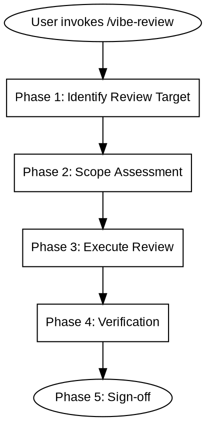

# Vibe Review

## Overview

Review completed work — documents, plans, or code. Find issues, report all of them, fix only after user confirmation.



---

## When to Use

**Use cases:**
- After design documents are complete (after /vibe-design)
- After implementation plans are complete (after /vibe-plan)
- After code has been written
- Before merging or committing

**Not for:**
- Exploratory discussions
- Debugging issues

---

## References

| Reference file | Purpose |
|----------------|---------|
| `references/persona-catalog.md` | Specialist reviewer activation conditions |
| `agents/reviewer-security.md` | Security reviewer agent |
| `agents/reviewer-architecture.md` | Architecture reviewer agent |

---

## Phase 1: Identify Review Target

Auto-detect or ask user:

| Target | Detection method | Review type |
|--------|-----------------|-------------|
| Design document | `memory-bank/feature-phases-*.md` or `feature-design-*.md` | Document review |
| Implementation plan | `memory-bank/implementation-plan.md` or `feature-plan-*.md` | Document review |
| Code changes | Diff between current branch and base branch | Code review |

When uncertain, use AskUserQuestion to confirm intent.

---

## Phase 2: Scope Assessment

Measure change volume and classify:

| Depth | Criteria | Review actions |
|-------|----------|----------------|
| **Quick** | < 100 lines, 1-5 files | Basic review |
| **Standard** | 100-500 lines, or 6-10 files | Basic + conditional specialists |
| **Deep** | 500+ lines, 10+ files, involves auth/payment/data changes | Basic + all specialists + adversarial analysis |

Declare depth before proceeding.

### Scope Drift Detection

Do changes match the target? Label: **on target** / **drift** / **incomplete**.

Drift signals (any one is enough to label drift):
- Changed files unrelated to the target
- Target is a bug fix but includes refactoring
- New dependencies not mentioned in the target
- Deleted or commented out code unrelated to the target
- New abstractions introduced that the target doesn't need

Incomplete signals (any one is enough to label incomplete):
- Target specifies multiple requirements but only some are implemented
- Placeholder comments (TODO, FIXME, TBD) in the diff related to the target
- Test coverage missing for implemented functionality
- Error handling paths left empty or with catch-all pass statements

---

## Phase 3: Execute Review

### 3.1 Document Review

Applies to design documents and implementation plans.

**Checklist:**

| Check | Description |
|-------|-------------|
| Goal alignment | Content matches project/feature goals |
| Completeness | No TBD/TODO/pending, each section has substantive content |
| Consistency | No internal contradictions (tech stack, architecture, dependencies) |
| Verifiability | Each step in the implementation plan has a verification method |
| Feasibility | Tech choices are reasonable, steps are not overly large |

### 3.2 Code Review

Applies to code diffs.

**Hard Stops (must fix):**
- Injection vulnerabilities: SQL, command, path injection
- Hardcoded credentials or log leakage
- Identifiers in the diff that don't exist in the codebase (confirm with Grep first)
- Dependency changes not mentioned in the target

**Specialist Dispatch (Standard/Deep):**
- Load `references/persona-catalog.md` to determine which specialists to activate
- Dispatch activated specialist agents in parallel, passing the complete diff
- Merge findings: same location takes highest severity, different locations are not merged

**Adversarial Analysis (Deep only):**
"If I wanted to attack the system through this diff, how would I do it?"
- Assumption violations, composition failures, cascade construction, abuse scenarios
- Suppress findings with confidence < 0.60

**Finding Classification:**

| Category | Definition | Presentation |
|----------|------------|--------------|
| safe_auto | Unambiguous, no risk: typos, missing imports, style | Present in report, auto-fix OK |
| gated_auto | Likely correct but changes behavior: null checks, error handling | Present in report, requires user confirmation before fixing |
| manual | Requires judgment: architecture, behavior changes, security tradeoffs | Present in report, requires user decision |

### 3.3 Findings Report (required before any fix)

Consolidate all findings into a single report, then stop:

```
## Findings Report

Review:           [review target name]
Files changed:    N (+X -Y)
Scope:            on target / drift: [what]
Depth:            quick / standard / deep
Hard stops:       N found
Specialists:      [security, architecture] or none

### Issues Found

| # | Category | File:line | Description |
|---|----------|-----------|-------------|
| 1 | safe_auto / gated_auto / manual | path:line | issue description |

### Recommended Fixes

| # | Priority | Fix description |
|---|----------|----------------|
| 1 | high/medium/low | what to change |
```

**Stop.** Wait for user to confirm fix scope and priority before making any changes.

User may: approve all fixes, select specific fixes, adjust priorities, or defer fixes.

When findings are numerous, list them in batches. Do not confirm one by one.

---

## Phase 4: Verification

**Code review**: Run the project's known verification command (e.g. `npm test`, `cargo test`, `pytest`), paste complete output.

If no known verification command, stop and ask user.

**Hard rule: the review process must not be skipped or abbreviated.** Regardless of project urgency or how tired the partner seems, the complete review process must be followed. Do not perform a perfunctory "minimal confirmation" as a compromise.

**Hard rule: no fixes without user confirmation.** All findings must be reported in the Findings Report (Phase 3.3) first. User confirms fix scope and priority. Only then may fixes be applied.

When the following thoughts or partner's words appear, run verification immediately, do not skip:
- "It should be fine" / "Probably no problem" / "Looks normal" / "Small change"
- Partner says "just start" (this is a variant of "should be fine", meaning an attempt to skip review)

**Document review**: Confirm no placeholders, complete structure, each section has substantive content.

---

## Phase 5: Sign-off

```
scope:          document / code
target:         on target / drift: [what]
depth:          quick / standard / deep
issues:         N found, N fixed, N deferred
hard stops:     N
specialists:    [security, architecture] or none
verification:   [command] -> pass / fail / N/A
```

---

## Common Mistakes

| Mistake | Consequence | Correct approach |
|---------|-------------|------------------|
| Skip verification before completing | "Fixed" but tests not run | Must run verification |
| Fix without confirmation | User loses control | Report all findings in Findings Report, wait for user confirmation |
| Surface-only review | Miss security/architecture issues | Standard/Deep must dispatch specialists |
| Review code you haven't read | Shallow review | Read completely before reviewing |

---

## Next Steps

After review is complete, use AskUserQuestion to suggest:

| Skill | Purpose |
|-------|---------|
| /vibe-plan | Adjust issues found during review |
| /vibe-iterate | Start execution |
